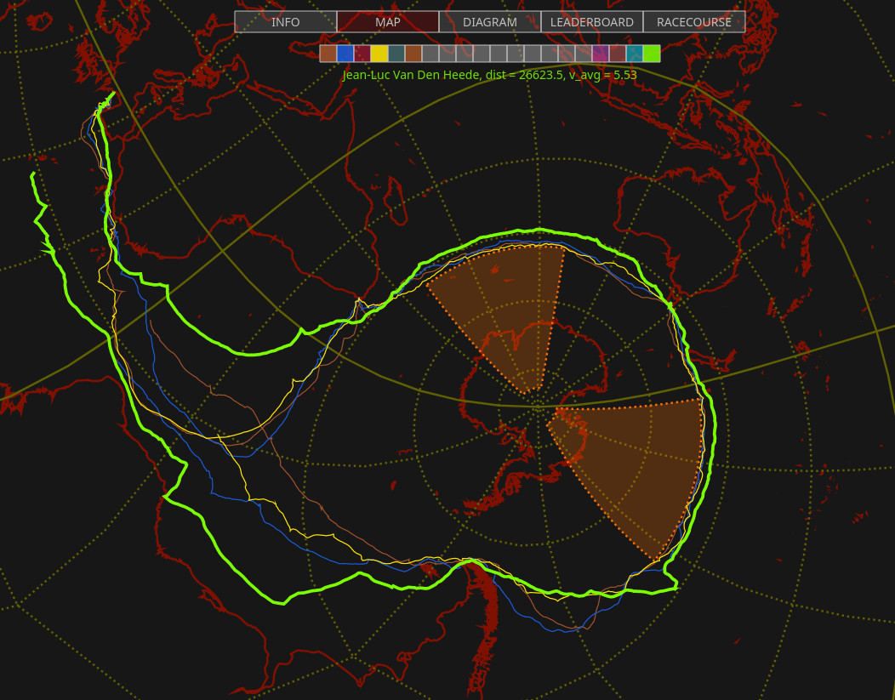

# Decoder and Data Viewer for YB Race Data

This is decoder and viewer for the YB race data.
YB (https://www.ybtracking.com/) is a commonly used software for tracking boat
races. They offer online versions written in JS as well as apps for Android and
IOS the follow the races.

This repo contains my own viewer for the data written in JS (see directory
"html"), as well as a command line version written in C (see directory "cli").
The latter contains a shell script which lets you download and decode all data
into JSON files for your own further processing.

This software is written specifically for the Golden Globe Race 2022 (see
https://goldengloberace.com/live-tracker/) but it should work with any other
race as well. `decyb.html` is the entry page and you can add the URL parameter
`race=...` to specifiy a specific race, e.g. `race=ogr2023` to show everything
about the Ocean Globe Race 2023.

The C version definitely works since it is just a decoder, the JS
version would need some adaptions (see code for details).

The JS code contains the full standalone viewer including the complete
projection code for the Spilhaus projection.

# Author

Bernhard R. Fischer <bf@abenteuerland.at>

